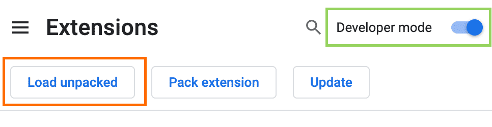
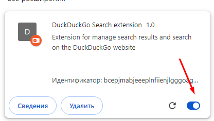
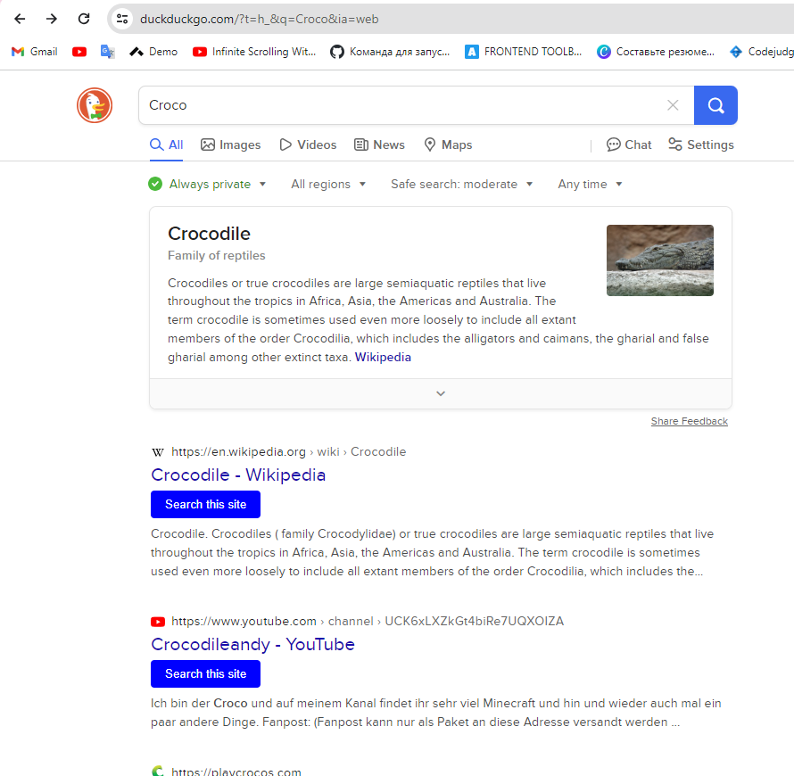
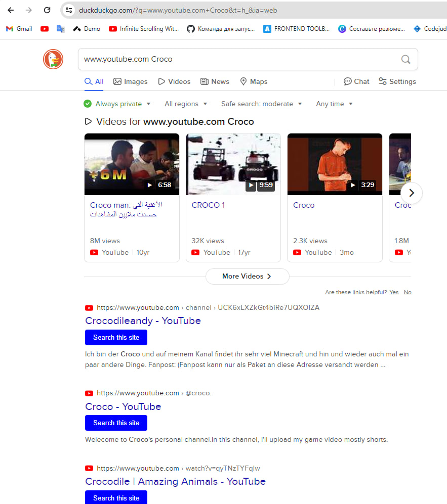

# DuckDuckGo Search extension

### Extension for manage search results and search on the DuckDuckGo website

## How to install
To install this extension in developer mode you should follow next steps:
1. Open the Google Chrome browser
2. Go to the Extensions page by entering chrome://extensions in a new tab.
    - Alternatively, click the Extensions menu puzzle button and select Manage Extensions at the bottom of the menu.
    - Or, click the Chrome menu, hover over More Tools, then select Extensions.
3. Enable Developer Mode by clicking the toggle switch next to Developer mode.
4. Click the Load unpacked button and select the extension directory on your computer.
5. Enable extension if it's not enabled

## How to use
1. Open the website [DuckDuckGo](https://duckduckgo.com/).
2. Enter your search term in the search field.
3. On the search results page, you should see search results with an additional button under each search result title item.
4. When you click on that button, it will run the current search with the domain from the search result URL you wanted to see.

## Examples of work

## How does this extension works
This extension includes a script in client page to enhance the functionality of the DuckDuckGo search results page by adding a "Search this site" button next to each search result. 
#### Here's a brief explanation of how it works:

1. Search Result Monitoring:
    - The script starts by defining variables to track the number of search results and sets up an interval to periodically check for changes in the search results.
    - It defines functions to find the main results block on the page and to wait for changes in the search results.
    - Even if elements were found on the page, the script will run a search for elements on the page with a longer (5 second) periodicity to check if new ones have appeared in order to add new functionality to them
2. Button Insertion:
    - When changes are detected in the search results, the script identifies organic search items (search results) on the page.
    - It adds a "Search this site" button next to each organic search item, provided it hasn't already been added and the item has a valid domain URL.
3. Handling More Results Button:
    - The script also handles clicks on the "More Results" button by stopping the current search result monitoring, resetting the interval to a shorter one, and restarting the monitoring process.
4. Button Functionality:
    - Each "Search this site" button, when clicked, modifies the search input by appending the domain URL of the corresponding search result to the current search query.
    - Then it triggers a search using the modified query by clicking the search button on the page.

In summary, this script dynamically adds functionality to the DuckDuckGo search results page, allowing users to easily refine their search queries to focus on specific domains directly from the search results.

## Known Issues or limitations
1. This extensions only functional on DuckDuckGo pages.
2. Relies solely on current HTML elements; any changes to them or their IDs will break render the extension.